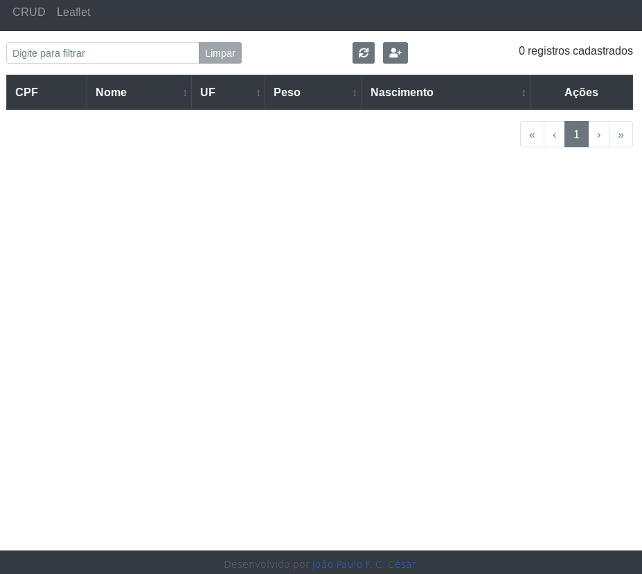

# GT4W   

Projeto com a implementação exigida no processo seletivo 2019.

## Execução

    1. Execute a aplicação Servidor;
    2. Execute a aplicação Cliente.
        - A configuração padrão é para comunicar com o "server" na porta 8080
        - Caso seja necessário modificar essa porta, altere em "client/src/APIService.js"

## Aplicação Cliente

[README](client/README.md)

## Aplicação Servidor

[README](server/README.md)

">